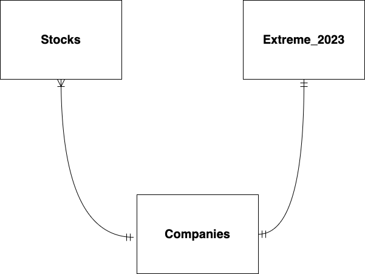

# Design Document

Comprehensive Financial Market Analysis

By Jackson Han
Copenhagen, Denmark
jackson.sz.han@gmail.com

Video overview: <https://youtu.be/h6Vuy6m1gG0>

## Scope

Assuming all underlying data has been imported into the database, the focus is on facilitating basic statistical analysis of stock market data for a couple of companies, such as Apple and ExxonMobil (XOM). The database captures fundamental stock attributes such as opening price, closing price, highs, lows, and trading volume on a daily basis over recent years. This data serves as a foundation for computing basic statistical measures like minimum, maximum, and Simple Moving Average (SMA), which are crucial for trend analysis and forecasting future stock behaviors. The analysis can be further enriched and fine-tuned by integrating this database with Python and MySQL, allowing for more sophisticated statistical and predictive analysis.

This database includes
* companies, which stores basic information of companies in the stock markets.
* stocks, which stores basic information of stock markets, like open price, close price, lows, highs, etc.
* extreme, which is a table to store the extreme values of different companies

Note:
Given that this relies on the sqlite3 system, computing a statistical value may necessitate more intricate coding rather than employing a window function.

## Functional Requirements

This database will support you:
* Retrieving daily stock data for specified companies over a given time frame.
* Calculating basic statistical measures like minimum, maximum, and Simple Moving Averages (SMA) for stock prices and trading volumes.
* Identifying basic trends based on statistical measures.
* Serving as a foundation for more advanced analysis by interfacing with Python and MySQL for further analytical capabilities.

Note:
The use of SQLite3 presents a limitation as it lacks some functions necessary for calculating certain statistical values like standard deviation directly within the database.

## Representation
Entities are captured in SQLite tables with the following schema.

### Entities

### Companies
The `companies` table includes:
* `id`, a unique identifier for each company
* `name`, the name of company
* `ticker_symbol`, the stock market ticker symbol associated with the company.

### Stocks
The `stocks` table includes:
* `id`, a unique identifier for each record of stock data.
* `company_id`, the identifier linking the stock data to the related company in the `companies` table. This creates a relationship between the `stocks` and `companies` entities, where each stock data record is associated with a specific company.
* `date`, the date the stock data is recorded.
* `open`, the stock price at the market opening
* `high`, the highest stock price during the trading session.
* `low`, the lowest stock price during the trading session.
* `close`, the stock price at market close.
* `volume`, the number of shares traded during the session

### Extreme_2023
The `extreme_2023` table includes:

* `id`, a unique identifier for each record of extreme value data
* `company_id`, the identifier linking the extreme values data to the related company in the Companies table. This creates a relationship between the Extreme and Companies entities, where each extreme value data record is associated with a specific company.
* `min_open`, the minimum opening price recorded for the company.
* `max_open`, the maximum opening price recorded for the company.
* `min_close`, the minimum closing price recorded for the company.
* `max_close`, the maximum closing price recorded for the company.
* `max_volume`, the maximum trading volume recorded for the company.

### Relationships

For `stocks` and `companies`, it's a many-to-one relationship, since one company may refer to many stock records and one record only connects to one company.

For `stocks` and `extreme`, it's a one-to-one relationship.

For `companies` and `extreme`, it's a one-to-one relationship.

## Optimizations

The indexes `company_id_index`, `name_index`, and `date_index` are created to speed up queries.

## Limitations

* The database design does not include built-in support for more complex statistical analysis or calculations like standard deviation, which would require external processing, possibly in a language like Python.
* Utilizing SQLite may also pose limitations in terms of performance, concurrency, and advanced analytical functionalities compared to other more robust database management systems.